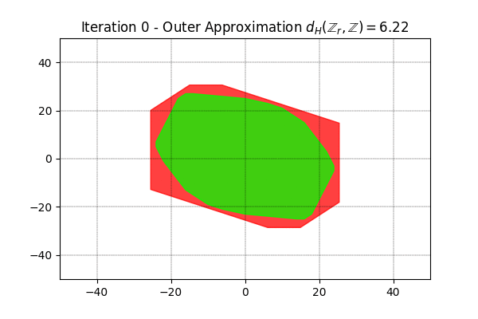
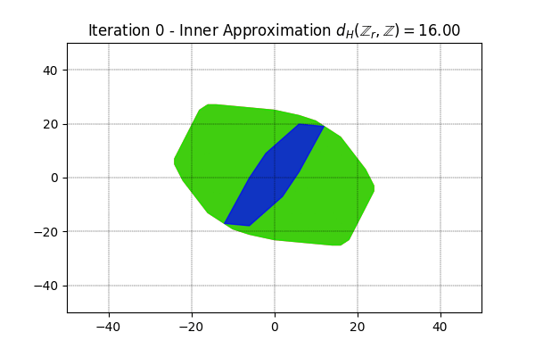
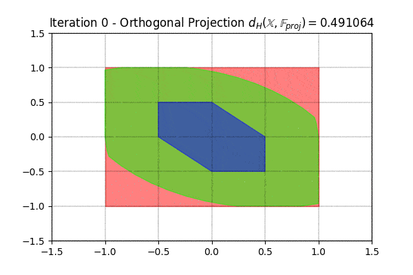

# pypolycontain: A Python Package for Polytope Containment Problems

The polytope containment problem is deciding whether a polytope is a contained within another polytope. This problem is rooted in computational convexity, and arises in applications such as verification and control of dynamical systems. The complexity heavily depends on how the polytopes are represented. Describing polytopes by their hyperplanes (H-polytopes) is a popular representation but not efficient for affine transformations of H-polytopes, which we refer to as AH-polytopes. Zonotopes, orthogonal projections of H-polytopes, and convex hulls/Minkowski sums of multiple H-polytopes can be efficiently represented as AH-polytopes. While there exists efficient necessary and sufficient conditions for AH-polytope in H-polytope containment, the case of AH-polytope in AH-polytope is known to be NP-complete. In this paper, we provide a sufficient condition for this problem that is cast as a linear program, which its size grows quadratically with problem size. Special cases on zonotopes, Minkowski sums, convex hulls, and disjunctions of H-polytopes are studied. These efficient encodings enable us to designate certain components of polytopes as decision variables, and incorporate them into a (mixed-integer) convex optimization problem. We present examples on zonotope containment problem, polytopic Hausdorff distances, zonotope order reduction, inner approximations of orthogonal projections, and demonstrate the usefulness of our results on formal controller verification and synthesis for hybrid systems. 


## Paper

A preprint of the paper on the theoretical background of this package is available [here](https://github.com/sadraddini/pypolycontain/blob/master/polytopic_containment.pdf)

## Setup
```
git clone https://github.com/sadraddini/pypolycontain.git
export PYTHONPATH=clone-dir:${PYTHONPATH}
```
where clone-dir is the path to the folder `pypolycontain`

## Dependencies:
* Gurobi 7.0 or later [Gurobi](https://gurobi.com) (Free Academic License)
* (For polytope visualization) [pycdd](https://pycddlib.readthedocs.io/en/latest/index.html)


## Polytopic Containment Encodings
Our package provides linear encodings for the following problems.
* A-Polytope inside H-Polytope (necessary and sufficient conditions)
* A-Polytope inside A-Polytope (sufficient conditions)
* Zonotope inside Zonotope (sufficient conditions)
* Minkowski Sum of A-Polytopes inside H-Polytope (necessary and sufficient conditions)
* A-Polytope inside Minkowski Sum of A-Polytopes (sufficient conditions)
* A-Polytope inside Convex Hull of A-Polytopes (sufficient conditions)
* Disjunctive A-Polytope inside H-Polytope (necessary and sufficient conditions)

## Polytopic Distance Functions:
Available Functions:
* Hausdorff Distance Between Polytopes
* Hausdorff Distance Between Zonotopes

## Zonotope Order Reduction:
Available Functions:
* Optimal Zonotope Order Reduction: Outer Approximation
* Optimal Zonotope Order Reduction: Inner Approximation

## Orthogonal Projection:
Available Function:
* Orthogonal Projection of Polytopes

## Examples:

### Finding the distance between two zonotopes
```python
import numpy as np
from pypolycontain.lib.zonotope import zonotope,zonotope_directed_distance
from pypolycontain.visualization.visualize_2D import visualize_2D_zonotopes as visZ

G_1=np.array([[1,0,0,1,1],[0,1,0,-1,-3]])
G_2=np.array([[1,0,1,1,2,4,-4],[0,1,1,-1,3,3,1]])
x_1=np.array([0,1]).reshape(2,1)
x_2=np.array([1,0]).reshape(2,1)

z1=zonotope(x_1,G_1,color="red")
z2=zonotope(x_2,G_2,color="green")
visZ([z2,z1],title="Zonotopes")
D12=zonotope_directed_distance(z1,z2)
D21=zonotope_directed_distance(z2,z1) 
```

We get D12=0, D21=11. The underlying norms are infinity-norm. D12=0 implies the red zonotope is contained within the green zonotope. The Hausdorff distance is max(11,0)=11.


### Zonotope Containment: Sufficient Conditions (Empirically shown to be very close to necessary)


### Zonotope Containment: Sufficient Conditions for Zonotope in the Convex Hull of Zonotopes


### Zonotope Order Reduction: An Optimization-based Approach



### Orthogonal Projections for Feasible Sets of Model Predictive Controllers

